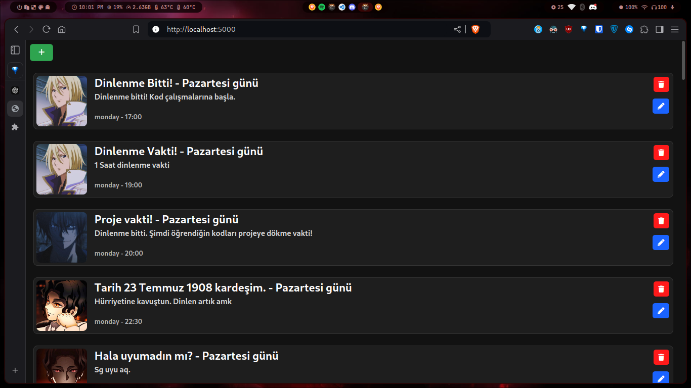
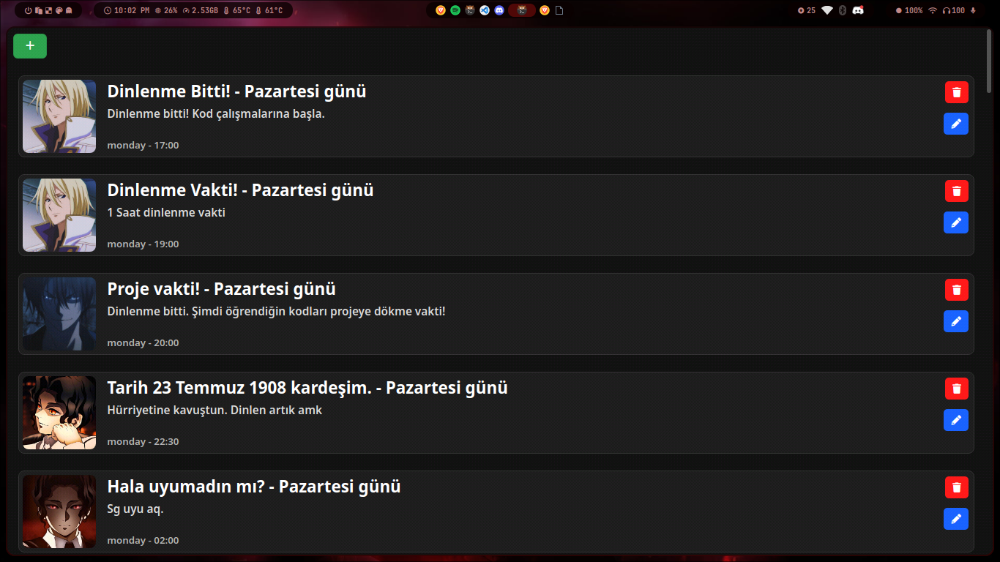

# Discipline4Everyone
The WebApp interface allows you to create a list of tasks for today, with a specified time for each. When the time comes, it sends a notification to remind you of the task. The main goal of the project is to encourage those who are just starting to adapt to a disciplined life.

I developed the app in my spare time, so it's not that great :/ But if you want to improve it, don't forget to fork my project!

